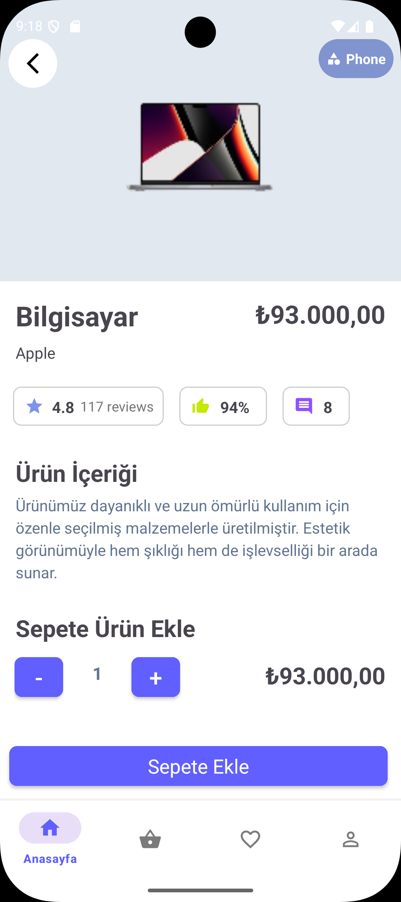
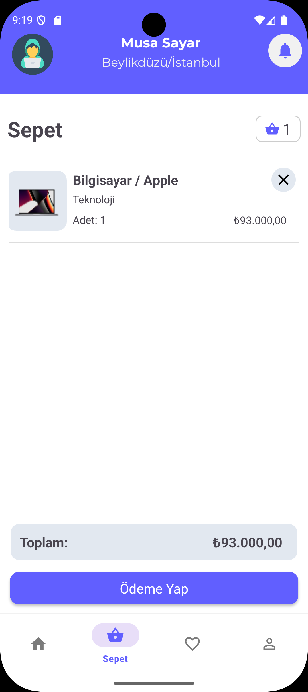
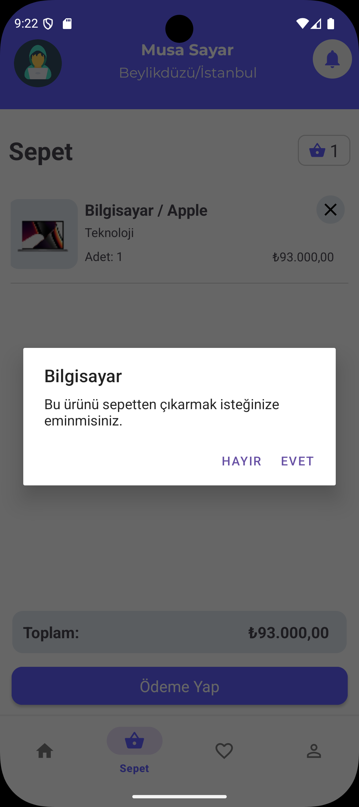
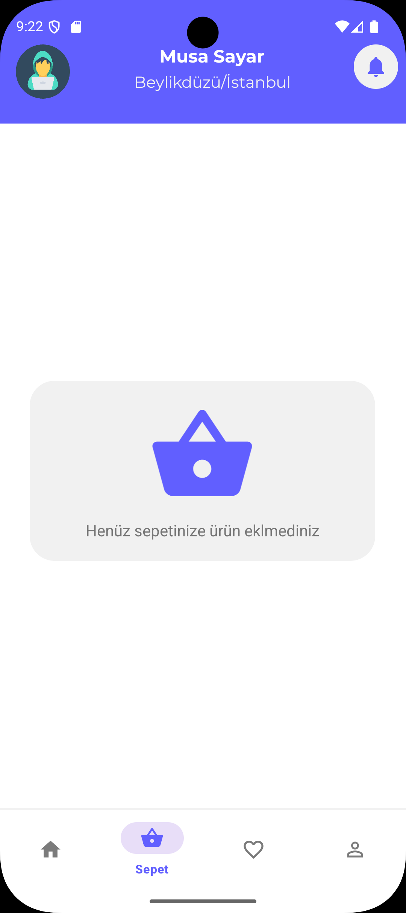
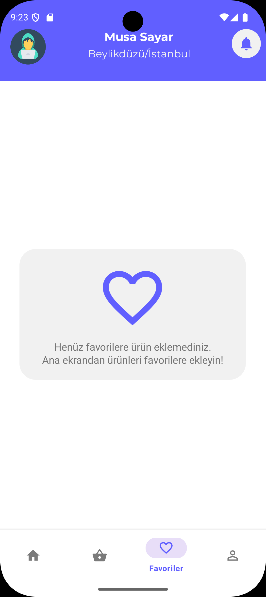
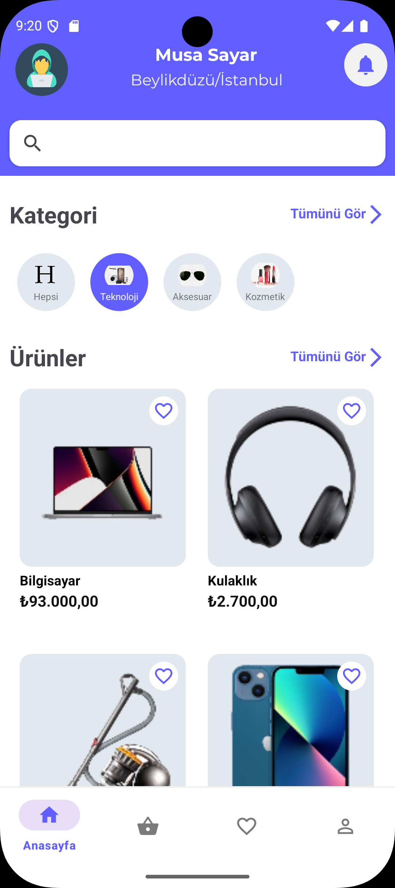
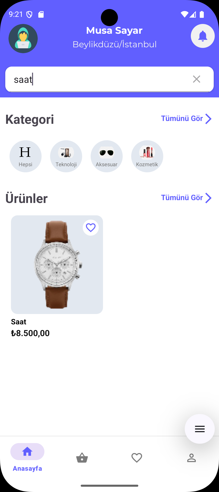
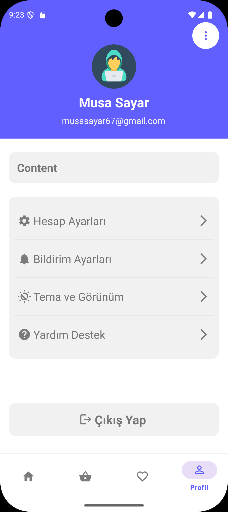

# Sayarica - E-Ticaret Uygulaması

Merhaba, ben Musa Sayar. Bu README dosyasında, geliştirdiğim **Sayarica** adlı Android e-ticaret uygulamasını detaylı bir şekilde tanıtacağım. 
Uygulama, modern Android geliştirme teknolojileri kullanılarak Kotlin ve XML ile geliştirilmiştir.
Sayarica, kullanıcıların ürünleri listeleyebileceği, ürün detaylarını görüntüleyebileceği, sepete ürün ekleyip sepetten ürün çıkarabileceği 
ve çeşitli ek özelliklerle zenginleştirilmiş bir e-ticaret platformu sunar.

## Uygulama Genel Bakış

Sayarica, kullanıcı dostu bir arayüze sahip, performans odaklı bir e-ticaret uygulamasıdır. 
Uygulama, sağlanan API endpoint'leri üzerinden veri alışverişi yaparak ürünleri listeleme, sepete ekleme, sepetten ürün silme gibi temel e-ticaret işlevlerini gerçekleştirir.
Ayrıca, ana sayfada ürün filtreleme, kategori bazlı ürün listeleme, favorilere ekleme/çıkarma ve favorileri görüntüleme gibi ek özelliklerle kullanıcı deneyimini zenginleştirir.

Uygulama, modern Android mimarisi ve en güncel kütüphaneler kullanılarak geliştirilmiştir.
Retrofit ile API çağrıları, Hilt ile bağımlılık enjeksiyonu, Navigation Component ile sayfa geçişleri ve Glide ile görsel yükleme işlemleri gerçekleştirilmiştir.


## 🚀 Uygulama Özellikleri

- 🛒 Ürünleri listeleme
- 🔍 Ürün detay sayfasına ulaşma
- ➕ Sepete ürün ekleme
- 🧺 Sepette ürünleri görüntüleme ve silme
- 🔤 Ana sayfada ürün isimlerine göre filtreleme
- 🗂️ Kategoriye göre ürün listeleme
- ❤️ Ürünleri favorilere ekleme / kaldırma
- 🌟 Favoriler sayfasında favorileri görüntüleme

## Kullanılan Teknolojiler ve Kütüphaneler

Sayarica, modern Android geliştirme standartlarına uygun olarak geliştirilmiştir. 
Aşağıda kullanılan temel kütüphaneler listelenmiştir:

- **AndroidX Lifecycle ViewModel (2.5.1)**: ViewModel ile veri yönetimi.
- **AndroidX Activity KTX (1.6.1)**: Aktivite işlemlerini kolaylaştıran KTX eklentisi.
- **Hilt (2.56.2)**: Bağımlılık enjeksiyonu için Dagger Hilt.
- **Glide (4.13.2)**: Görsellerin hızlı ve verimli yüklenmesi.
- **Retrofit (2.6.0)**: API çağrıları için HTTP istemcisi.
- **Gson (2.9.0, Converter 2.5.0)**: JSON veri işleme ve dönüşüm.
- **Navigation Component**: Sayfalar arası geçişlerin yönetimi.

## Kurulum ve Kullanım

1. **Depoyu Klonlayın**:
   ```bash
   git clone https://github.com/musayar9/E_Commerce_Final_Case.git
   ```

2. **Gerekli Bağımlılıkları Yükleyin**:
   - Android Studio'yu açın ve projeyi içe aktarın.
   - `build.gradle` dosyasında listelenen bağımlılıkların senkronize edildiğinden emin olun.

3. **API Entegrasyonu**:
   - Sağlanan API endpoint'lerini `Retrofit` servislerine entegre edin.
   

4. **Uygulamayı Çalıştırın**:
   - Android Studio üzerinden bir emülatör veya fiziksel cihaz seçerek uygulamayı derleyin ve çalıştırın.

## Uygulama Ekran Görüntüleri

Aşağıda Sayarica uygulamasının temel ekranlarının görselleri tablo şeklinde sunulmuştur:

| Ana Sayfa                                            | Ürün Detay                                           | Sepet                                              |
|------------------------------------------------------|------------------------------------------------------|----------------------------------------------------|
|      |  |      |
|  |    |  |
|     |     |  |
|      | 


## Mimari ve Teknik Detaylar

- **Mimari**: Uygulama, MVVM (Model-View-ViewModel) mimarisine uygun olarak geliştirilmiştir. ViewModel'ler, veri işleme ve kullanıcı arayüzü arasındaki iletişimi sağlar.
- **Veri Alışverişi**: Retrofit ve Gson ile API'den alınan veriler JSON formatında işlenir ve adapterlar aracılığıyla RecyclerView'lerde gösterilir.
- **Sayfa Geçişleri**: Navigation Component kullanılarak güvenli ve modüler sayfa geçişleri sağlanmıştır.
- **Bağımlılık Enjeksiyonu**: Hilt ile bağımlılıklar merkezi bir şekilde yönetilir, bu sayede kodun test edilebilirliği ve bakımı kolaylaşır.
- **Görsel Yükleme**: Glide ile ürün görselleri hızlı ve önbellek dostu bir şekilde yüklenir.
- **Kullanıcı Bildirimleri**: MotionToast ile kullanıcıya başarılı işlemler veya hatalar için görsel geri bildirimler sunulur.


## Geliştirici

Musa Sayar  
E-posta: [musasayar67@gmail.com](mailto:musasayar67@gmail.com)